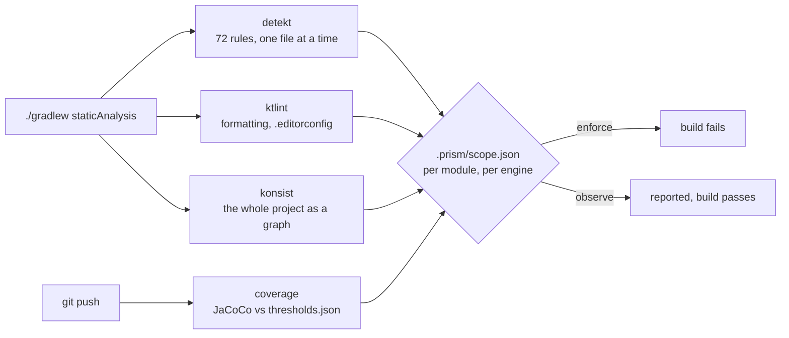
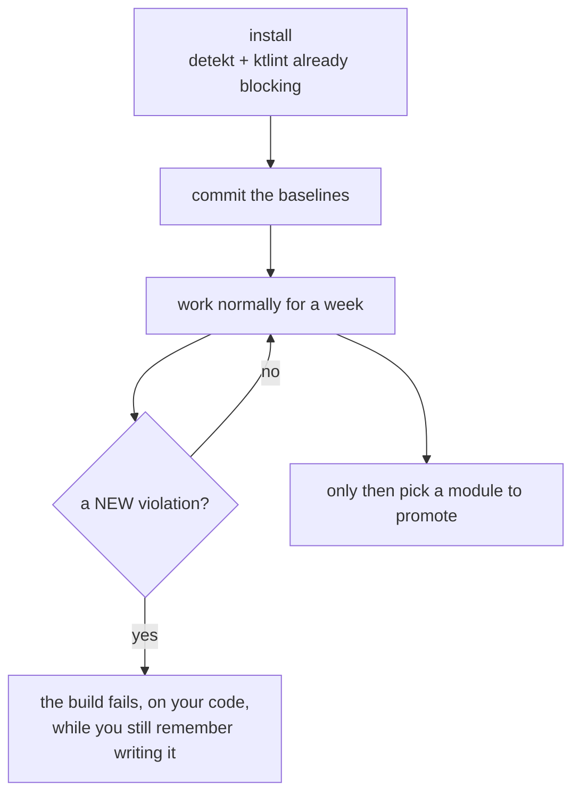
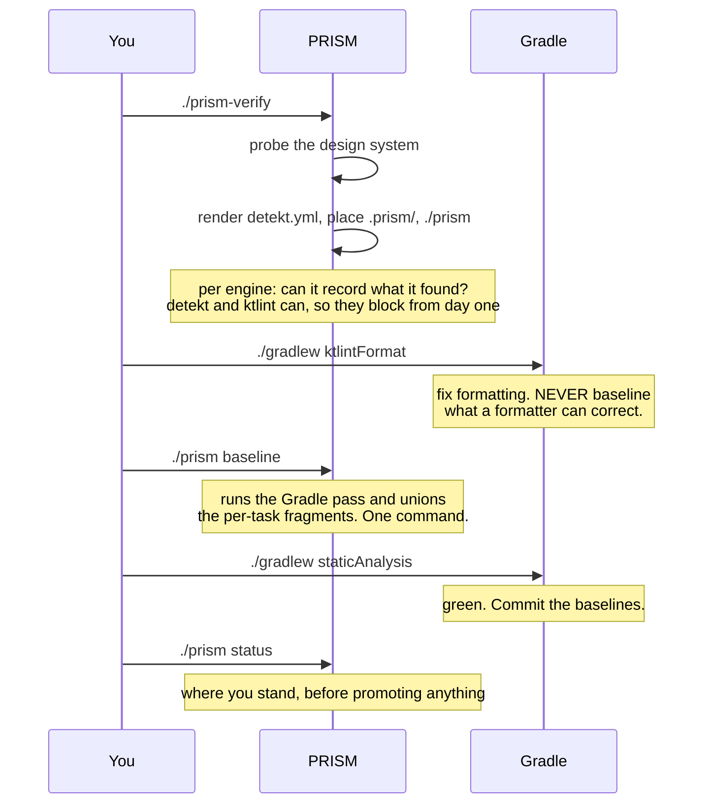
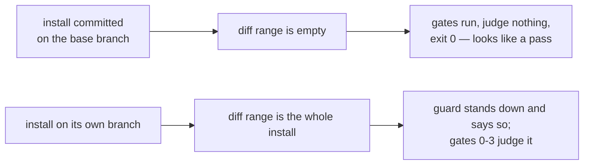
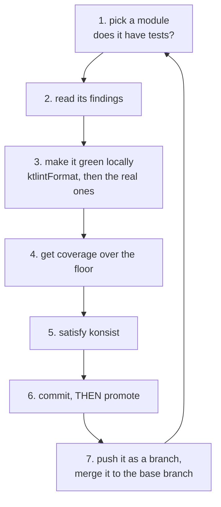

# Adopting PRISM in a codebase that already exists

Installed at `.prism/INSTALL-BROWNFIELD.md`.

PRISM was extracted from a repository that grew up under its own gates. Yours
did not. Installing at full strength into an existing codebase means day one is
a red build with several hundred findings, none of which are about the work you
were doing — and the usual outcome of that is the whole thing gets switched off
in week two.

This document is how not to do that.

---

## What PRISM will find, and what the number means

Four engines run. Each reports independently:



A finding is not a bug report about you. Most of what you see on day one is a
convention this repository never adopted — PRISM's test-stack rules assume
JUnit 5 and AssertK, so a suite built on JUnit 4 and Truth reports **every test
file**, and no amount of restructuring makes that go away.

**That is expected, and it is not a reason to switch rules off.** It is a reason
to observe them.

---

## When to introduce PRISM, and what to enable before you enforce anything

The question this document gets asked most is *when* — at the start of a
sprint, after a release, once the backlog is clear. None of those is the
answer. The answer is about the state of the repository, not the calendar.

**Install when the repository builds and its tests run. Not before.**

That sounds obvious and it is the step people skip, because a repository that
builds in Android Studio is not the same as one that builds under a gate. Three
things are worth knowing before you unpack anything.

### Check these three before you install

```sh
./gradlew build          # every module, including release variants
./gradlew test           # not `ls src/test` — see below
git status               # the tree should be clean
```

| What you are checking | Why it matters once PRISM is in |
|---|---|
| **the release build** | PRISM's gates build **release** variants, not just debug. A release build that was already broken becomes a red gate on every turn, and it reads as PRISM's fault |
| **that tests compile** | a `src/test/` directory is not a working test framework. Measured on a 26-module repository: 18 of 19 `ExampleUnitTest.kt` stubs **had never compiled** — the library convention plugin supplied `kotlin("test")` and no JUnit, so the files were dead code nothing reported |
| **a clean tree** | the install writes a detekt and ktlint baseline per module, `.editorconfig`, `detekt.yml`, `./prism` and `.prism/`. You want that as its own commit, separable from your work |

If the release build is broken, either fix it first or decide, deliberately,
that you will live with a red gate until you do. Both are fine. Discovering it
on day two and blaming the framework is what this list exists to prevent.

### Nothing needs enabling — the install decides per engine

There is no "observe mode" to turn on first and no phase to graduate out of.
The install measures what is already here and asks, **per engine**, whether that
engine can *record* what it found:

| engine | can it record today's findings? | installed as |
|---|---|---|
| **detekt** | yes — one `detekt.baseline.xml` per module | **`enforce`** |
| **ktlint** | yes — one `ktlint.baseline.xml` per module | **`enforce`** |
| **konsist** | **no** — it is a JUnit suite with no baseline | `observe` |
| **coverage** | **no measurement exists yet** | `observe` |

So a codebase with several hundred findings starts with **detekt and ktlint
blocking on day one**, their history recorded and quiet, and a new violation
refused. That is not a compromise; it is what a baseline is for. "Has findings"
and "must not block" are different questions, and only the engines that cannot
answer the first one get to observe.

Measured on Runique, 26 modules, at install:

```
293 detekt findings      →  264 baselined, detekt ENFORCES in all 26 modules
 42 ktlint findings      →  baselined per module, ktlint ENFORCES
  5 konsist violations   →  observe (nowhere to record them)
  no coverage            →  observe (nothing measured yet)
```

**What you enable before enforcing anything is a baseline, not a setting.** The
recording *is* the enabling step.

### What the first week looks like



Do not promote anything in week one. The baselines are already doing the work
that matters — holding *new* code to the standard — and the promote walk below
costs real time per module. Let the gate prove itself on your own commits first.

---

## The install, in order

The order matters and it is not the obvious one.



**`./prism baseline` is one command because it has to be two steps.** detekt's
own baseline task *replaces* the file it is pointed at, so on a 26-module
repository every task writing one root file would leave the last module's
findings and nothing else — a baseline that looks complete and covers one
module. PRISM writes a fragment per task and then unions them per module. Both
halves run under that one verb; there is nothing to remember and no order to get
wrong.

**The install already ran it.** You run it again when you add modules, or when
you want to re-record after a large merge. Running it over an existing baseline
is refused rather than silently absorbing everything written since.

**Commit the baselines.** Every `<module>/detekt.baseline.xml` and every
`<module>/ktlint.baseline.xml` are the record of what was already here. They are
deliberately not in the `.gitignore` fragment.

**Do all of this on a branch.** The install is a pull request like any other
change — see [landing the install](#landing-the-install-and-the-push-that-silently-judges-nothing)
for why that is not a formality: on a branch the gates judge the install, and on
the base branch they judge nothing at all.

---

## Where you stand, at any time

```sh
./prism status
```

```
POSTURE — what blocks, per module

MODULE                             detekt    ktlint    konsist   coverage
:app                               observe   observe   observe   observe
:core:data                         observe   observe   observe   observe
:feature:login                     enforce   enforce   enforce   enforce

SUPPRESSED — what was already here when PRISM arrived

  detekt   41 findings suppressed, so they do not block
  ktlint   1 module baseline(s):
           app                                            12 entries

  A suppressed finding does not block. A NEW violation of the same rule
  still does — that is the whole difference between a baseline and
  switching a rule off.

COVERAGE — what the coverage gate would say right now

MODULE                             KIND            STATE              COVERAGE REQUIRED
---------------------------------------------------------------------------------------
:app                               android-jvm     observe (short)         61.2       80
:core:data                         jvm             observe (clears)        88.0       80
:feature:login                     jvm             ok                      91.4       80
```

Three sections, and they mean different things. **Posture** is what blocks.
**Suppressed** is what was already here. **Coverage** is what the gate would say
if you pushed right now. A module can be `enforce` with a large
baseline — that is the normal mid-adoption state, and it means *new* code in
that module is held to the standard while the old code waits its turn.

---

## Landing the install, and the push that silently judges nothing

A brownfield repository already has a remote and a base branch, so the greenfield
advice — *add a remote* — does not apply. The question here is different: **does
the install land as its own pull request, like any other change?**

**Yes, and it should.** That is the answer this section exists to give, because
the alternative looks easier and verifies nothing.

### Land it as an independent PR

```sh
git checkout -b chore/install-prism
# run the install, commit the baselines
git push -u origin chore/install-prism
```

The push prints this, and proceeds:

```
prism: pre-prism does not carry a PRISM install yet, so there is no configuration
       to weaken. This push is the install. Later pushes are compared against
       what it lands.
```

**That line is the configuration guard, and it is the only gate that stands
down.** It compares your PRISM configuration against the base branch, and the
base branch has none — so there is nothing to have weakened. Every other gate
runs in full, against a real diff:

| gate | on the install PR |
|---|---|
| **guard** | **exempt**, and it says so out loud. `.prism/prism.json` does not exist on the base branch, so there is no earlier configuration to compare against |
| **0** | **runs.** `./gradlew staticAnalysis` over every module, with your new baselines in force |
| **1–2** | **runs.** The build, release variants included |
| **3** | **runs.** Coverage for any module where coverage enforces — usually none yet, since the install leaves coverage observing |

Measured: a `println` added to `:core:domain` on an install branch whose base
branch had no PRISM was refused at **GATE 0**, guard exemption and all.

So an install PR is a reviewed, fully verified change. Your reviewer sees the
baselines, `detekt.yml`, `.editorconfig` and `scope.json` as one self-contained
diff, which is the only time they will ever be legible as a set.

### The alternative is the trap

Committing the install straight onto the base branch works, and verifies nothing.

Every PRISM gate answers *"what changed?"* as a diff between your branch and
`baseBranch` in `.prism/prism.json`. If you are **on** that branch, the range is
empty. The gates run, find nothing to judge, and allow everything.

Measured, pushing the install commit on `main` with `baseBranch: main`:

```
$ git push -u origin main
To https://github.com/…
 * [new branch]      main -> main
```

**No gate output whatsoever.** The pre-push hook ran, judged an empty range, and
exited 0. This is the most dangerous moment in a brownfield adoption, because it
is indistinguishable from a clean pass — and unlike a greenfield project, where
you notice you have no remote, here everything looks normal.



The same rule holds for everything afterwards, including every promotion:
**branch, push, merge.** Never work on the base branch.

### Prove the gate is live before you trust it

Whichever way the install landed, do not take a green push as evidence. Plant one
violation of a rule that is **already in a baseline** and try to push it:

```kotlin
// core/domain/src/main/java/…/GateProof.kt
object GateProof {
    fun shout() {
        println("this is a new violation")
    }
}
```

Measured on Runique, where `ClassBodyMissingLeadingBlankLine` had **36 entries
across the baselines** and `NoConsoleLogging` had none:

```
> Task :core:domain:detekt FAILED
e: …/GateProof.kt:5:9 Remove the 'println' call from shipped code. [NoConsoleLogging]
e: …/GateProof.kt:4:5 The class body starts directly under the header. [ClassBodyMissingLeadingBlankLine]

* What went wrong:
Execution failed for task ':core:domain:detekt'.
> Analysis failed with 2 issues.

error: failed to push some refs
```

That is the whole claim of a baseline, demonstrated in one push: **36 existing
instances of that rule stayed quiet and the 37th was refused.** Delete the file
afterwards.

> **This is the differential test that fits a brownfield install.** A test that
> plants the same violation in a promoted module and an observed one does not
> work here — after a real install *every* module enforces detekt and ktlint, so
> there is no observed module to compare against. The axis that separates pass
> from fail is not the module; it is **baselined versus new**.

### What every push after the merge runs

Once the base branch itself carries PRISM, the guard stops standing down and the
full ordered set runs on every push, stopping at the first failure.
[Step 7 of the promote procedure](#step-7--push-it-as-a-branch-and-merge-it-to-the-base-branch)
covers what each gate catches, because that is the push where it matters.

**Pushing banks nothing.** The gates re-evaluate against the state of each push.
Getting one through today buys nothing tomorrow.

---

## Promoting a module — the procedure

Promoting means: retire what this module had suppressed, turn all four engines on
for it, and prove the result travelled to everybody else. Seven steps, in this
order, and the order is not negotiable — the last three are where a repository
with a remote differs from one without.



**The one rule that explains the order: achieve the coverage first, promote
second.** Coverage is the only engine that does not run in `./gradlew
staticAnalysis` and does not run locally at all — it runs at `git push`. Promote
before the tests exist and you get a green local build and a refused push, with
nothing on screen connecting the two.

---

### Step 1 — pick a module, and find out whether it has tests

Start at the **leaves of the dependency graph**: modules nothing else depends on
for compilation, which depend on least themselves. Smallest, fewest framework
entanglements, and a mistake in one does not cascade. Work outward — `:core:*`
before `:feature:*`, and `:app` last, because `:app` is where the release
configuration, the instrumented suite and every dependency meet at once.

**Then ask the tool, before you commit to the choice:**

```sh
./prism status :core:domain
```

```
MODULE                             KIND            STATE              COVERAGE REQUIRED
:core:domain                       no tests        blocks if promoted        -       80
```

The `KIND` and `STATE` columns are the whole decision. There are four answers and
they cost very different amounts of your day:

| `KIND` | `STATE` | What it means | What to do |
|---|---|---|---|
| `jvm` | `observe (clears)` | unit tests exist and already clear the floor | **promote today.** This is your first module |
| `jvm` / `android-jvm` | `observe (short)` | tests exist, coverage is under the floor | write tests until it clears. Ordinary work, bounded |
| `combined` | needs a device | a `src/androidTest/` exists, so measuring needs a booted emulator | boot one, or leave this module for later |
| `no tests` | **`blocks if promoted`** | production code, no `src/test` and no `src/androidTest` | **stop.** See the next section |

> **The obvious pick is often the trap.** In a Now-in-Android-shaped repository
> the instinct is `:core:domain` — no Android dependencies, no framework types,
> the module whose correctness matters most. Measured on Runique, **six of 26
> modules have no test sources at all, and five of those six are the `:*:domain`
> leaves.** `./prism coverage` on one of them reports `no test sources, so
> nothing to measure`, which reads as benign and is not: it means the push gate
> will refuse the module the moment it enforces.

#### When the module has no tests

You have two honest options and neither is wrong:

| | |
|---|---|
| **pick a different module first** | one that already has tests, so you prove the whole loop end to end before spending a day writing them |
| **write this module's first tests, then promote** | on a domain module usually the better use of the time — but budget for it, because a codebase with history rarely has a working test framework on the classpath |

If you promote it anyway, this is what you get — after making everything else
green:

```
$ git push
PUSH DENIED — VERIFICATION GATE 3

These modules have production code but no tests at all (no src/test
and no src/androidTest), so no coverage could be measured:
  :core:domain
```

That is the gate working. It is not a bug, and it will not go away by re-running.

---

### Step 2 — read the findings, do not just count them

```
core/domain/build/reports/detekt/detekt.html            ← browse
core/domain/build/reports/detekt/detekt.xml             ← what the gate parses
tooling/konsist/build/reports/tests/test/index.html     ← architecture tests
```

ktlint writes no file — re-run `./gradlew ktlintCheck` and read the console.

---

### Step 3 — make it green locally

**Formatting first, always.** Never spend attention on something a formatter
corrects:

```sh
./gradlew ktlintFormat
./gradlew staticAnalysis --no-configuration-cache
```

What remains is the real work. Measured on `:core:domain`, whose 11 suppressed
findings came to: 8 × `ClassBodyMissingLeadingBlankLine`, 1 `MagicNumber` (a
`200L` emit interval that became a named constant), 2 `SingleLetterIdentifier`
(the `a` and `c` of a haversine formula, now `haversine` and `angularDistance`).

Roughly three quarters of a typical module's findings are mechanical. The
remaining quarter is where you learn something about the code.

---

### Step 4 — get coverage over the floor

```sh
./prism coverage :core:domain
```

```
  :core:domain                   jvm         unit tests
                                 94.9% of lines covered, floor 80 — clears it
```

Anything other than `clears it` means stop here and write tests. `would DENY
(low)` is the push you have not made yet.

#### If this module has never had a working test framework

On a codebase with history this is where the day goes, and none of it is about
PRISM. Three things, in order:

**1. The test framework is probably not on the classpath.** A `src/test/`
directory is not a working test framework. Measured on Runique: the JVM
convention plugin adds *no* test dependencies, and the Android one adds only
`kotlin("test")`, which with no framework present resolves to a base artifact
where even `kotlin.test.Test` is unresolved — **18 of 19 `ExampleUnitTest.kt`
stubs had never compiled**, and nothing said so. Check with `./gradlew test`, not
with `ls`.

```kotlin
// core/domain/build.gradle.kts
dependencies {
    testImplementation(libs.junit.jupiter)
    testImplementation(libs.assertk.jvm)
    testRuntimeOnly(libs.junit.jupiter.engine)
    testRuntimeOnly(libs.junit.platform.launcher)
}

tasks.withType<Test> {
    useJUnitPlatform()
}
```

All four aliases are in your version catalog after the install.
`junit-platform-launcher` is not optional and its absence does not say so — it
surfaces as *"Failed to load JUnit Platform"*, which reads like a Gradle problem.

**2. Write JUnit 5 and assertK, not JUnit 4.** `JUnit4InJvmUnitTest` and
`NonAssertKAssertion` are among the most-baselined rules on an existing codebase
— 38 and 19 entries on Runique — so they are quiet on the files that were already
there and they fire on the file you write today. It is not more work, just
different imports.

**3. A test goes in its subject's package.** konsist refuses a flat test layout:

```
tests mirror their subject's package: 3 of 5 declarations violate this rule.
  - LocationTest  (core/domain/src/test/java/com/plcoding/core/domain/LocationTest.kt)
```

`LocationTest` belongs in `…core.domain.location`, beside the `Location` it
covers, so the two move together and internal declarations stay reachable. One
`mkdir` and one `package` line per file — much cheaper to know now than after
twenty files.

Then format what you wrote. **Your new test files are not in any baseline.**

```sh
./gradlew ktlintFormat
```

---

### Step 5 — satisfy konsist, which has no baseline and therefore no on-ramp

detekt and ktlint let you record today and enforce tomorrow. **konsist cannot** —
it is a JUnit suite, there is nothing to record into, so it observes until every
violation it finds is genuinely fixed. That is why promoting a module can fail on
a rule you have never seen, in a file you did not touch.

Measured, promoting `:core:domain`:

```
repository functions return a typed result: 3 of 10 declarations violate this rule.
Requirement: failure must be visible in the return type rather than signalled by
an exception, a null or a boolean — so the caller cannot forget it. A function
that genuinely cannot fail is exempted at the declaration with an annotation
named LocalOnly, never by an exclusion in this rule. PRISM DOES NOT SHIP THAT
ANNOTATION: this rule matches it by SIMPLE NAME, so declare your own in a module
your data layer already depends on.
```

`RunRepository.deleteRun`, `syncPendingRuns` and `deleteAllRuns` returned `Unit`.
They are device-local — a Room delete that removes nothing is not an error, a
sync request is fire-and-forget — so the honest fix is the exemption the rule
names, not a result type with nothing to put in it:

```kotlin
/** Marks a repository function that cannot fail in a way the caller could act on. */
annotation class LocalOnly
```

**The annotation is yours, matched by simple name, and the KDoc is the point.** An
exclusion in a rule config is invisible six months later; an annotation at the
declaration, with its reason written beside it, is not.

---

### Step 6 — commit, then promote

**Commit first.** Promotion *deletes* baseline files, and setting the posture back
does not restore them. Only git does.

```sh
git add -A && git commit -m "core:domain clean and covered"
./prism promote :core:domain
./gradlew staticAnalysis --no-configuration-cache
```

What `promote` does, in this order:

1. **deletes** `core/domain/detekt.baseline.xml`,
2. **deletes** `core/domain/ktlint.baseline.xml`,
3. sets all four engines to `enforce` for `:core:domain` in `scope.json`.

Suppressions first, posture second — the other order leaves a window in which the
module blocks on findings that were always going to be dropped.

**If `staticAnalysis` is now red, the findings were real.** That is the check, and
it is the reason this step comes after step 3 rather than instead of it.

---

### Step 7 — push it as a branch, and merge it to the base branch

This is the step that has no equivalent in a fresh project, and it is where a
promote actually takes effect for anyone but you.

**Never promote on the base branch itself.** Every PRISM gate answers *"what
changed?"* as a diff between your branch and `baseBranch` in
`.prism/prism.json`. On that branch the range is empty, so the gates run, judge
nothing, and exit 0 — indistinguishable from a pass.

```sh
git checkout -b chore/promote-core-domain
# steps 1-6 happen here
git push -u origin chore/promote-core-domain
```

**The push is the first time the promotion is actually tested**, because gate 3
runs nowhere else:

| gate | what it runs | what it catches here |
|---|---|---|
| **guard** | is this push weakening any PRISM configuration? | a promote **strengthens**, so it passes. Promotion is never refused — only demotion is, and only in the push that needed it |
| **0** | `./gradlew staticAnalysis` | the findings you just stopped suppressing |
| **1–2** | the build, every affected module | **release variants included** |
| **3** | coverage vs `thresholds.json` | the module you just made coverage enforce in |

**Then merge it, as its own pull request.** A promotion is a one-line diff in
`scope.json` plus two deleted baselines plus whatever you fixed — reviewable in a
way that a promotion buried inside a feature branch is not.

Two things that only matter because there is a remote:

- **Until it is merged to `baseBranch`, nothing has changed for your
  teammates.** The guard and every gate resolve `scope.json` *from the base
  branch* for comparison. Your branch enforces `:core:domain`; theirs does not,
  and that is correct — the repository's posture is what `main` says it is.
- **When it merges, everyone's build starts enforcing that module.** They will
  pull and find a module that blocks where it did not yesterday. Because the
  baselines are gone and the module is genuinely clean, this should be quiet —
  but it is a change to everyone's gate, which is why it belongs in its own PR
  with a title that says so.

**Pushing banks nothing.** The gates re-evaluate against the state of each push.
Getting one through today buys you nothing tomorrow.

---

### Set the floor, if you want it above the default

Posture and floor are **two different questions**:

| Question | Answered by |
|---|---|
| does coverage **block** for this module? | `.prism/scope.json` → `"coverage": "enforce"` |
| what number must it **clear**? | `.prism/verify/thresholds.json` |

```jsonc
{
  "default": 80,
  "overrides": { ":core:domain": 100 }
}
```

`:core:domain` at 100 is what `overrides` is for — security-critical algorithmic
code, where 80% means one line in five of your crypto is never executed by a
test. An override may **start below** the default — that is the supported
on-ramp — but it can only ratchet up: the push guard denies lowering `default`,
lowering an existing override, or removing one.

### Prove it, differentially

A clean module passing an enforced gate proves nothing on its own — it might be
passing because nothing is wired up. What you prove depends on which engine you
just promoted, and the two cases are not the same.

**konsist or coverage**, which were observing before: plant the *same* violation
in the module you promoted and in one you did not.

| Where | Expected |
|---|---|
| the promoted module | the build **fails** |
| an observed module | the finding is **printed**, the build passes |

If both fail, you did not promote a module — you promoted the default. If
neither fails, the gate is not live at all.

**detekt or ktlint**, which were already enforcing everywhere: there is no
observed module to compare against, so that test cannot run. The axis here is
**baselined versus new**, and it is the stronger proof anyway — the same rule id,
quiet on the old code and refused on the new:

| Where | Expected |
|---|---|
| a finding already in the baseline | quiet — `staticAnalysis` is green with all of them present |
| a **new** instance of that same rule | the build **fails** |

Measured on Runique: 264 findings baselined and `staticAnalysis` green; one new
`ClassBodyMissingLeadingBlankLine` — a rule with **36 entries already in the
baselines** — denied the push.

> **A green build can lie about this.** Gradle's configuration cache carries the
> posture, because `ignoreFailures` is set at configuration time. If a promote
> appears to have done nothing, re-run with `--no-configuration-cache`.

### Then the next module

`./prism status` shows how much is left. Module by module is not as slow as it
looks: the first one is the expensive one — it is where you find out what your
convention plugins actually put on the test classpath — and siblings of the same
shape then take minutes, because the findings repeat.

**What the first one actually costs**, measured on `:core:domain`, a module with
11 baselined findings and no tests:

| step | what it was |
|---|---|
| retire the 11 suppressions | 8 × `ClassBodyMissingLeadingBlankLine`, 1 `MagicNumber`, 2 `SingleLetterIdentifier` |
| satisfy konsist | one `LocalOnly` annotation, three declarations marked |
| wire the test framework | four dependency lines and `useJUnitPlatform()` |
| write the tests | 16 tests across five classes → **94.9%** of lines, floor 80 |
| move them into their subjects' packages | konsist refused the flat layout |

Two of those five steps are the module's first tests, and they do not repeat on
its siblings. The other three do, and they get faster each time.

### Two things that bite at multi-module scale

**The ktlint baseline is one file until it is not.** ktlint's Gradle plugin
defaults every module's task to the **root** `ktlint.baseline.xml`, so fifteen
module tasks write to one file and the last one wins. PRISM points each module's
task at its own, which is why promoting a module deletes a file in that module.

**One detekt id can appear in nineteen modules.** detekt computes a baseline id
from the rule and the finding, not from the path.
`JUnit4InJvmUnitTest:ExampleUnitTest.kt:import org.junit.Test` is **one id**,
identical in every module with a generated `ExampleUnitTest.kt` — measured at 19
of 26 on one repository. Retiring it in `:run:domain` retires it **only there**.
That is correct, and it is why the baselines are per module — but it means "I
fixed that rule" is a per-module claim, not a repository-wide one.

### Stepping back, if you have to

Set those engines back to `observe` in `.prism/scope.json`. That restores what
blocks — but **the baseline entries the promote dropped are gone.** Recover them
with `git checkout core/domain/detekt.baseline.xml core/domain/ktlint.baseline.xml`,
which only works because you committed first.

And you cannot demote **in the push that needed the demotion**. The guard
refuses it. Make it its own commit and merge that first.

### If this repository is one module

Then there is no module axis to walk, and you move engine by engine instead:
`./prism promote --engine detekt` once detekt is clean, then ktlint, konsist and
coverage. [Starting fresh](INSTALL-GREENFIELD.md) walks that axis in full — it
applies to a one-module codebase with history exactly as it does to a new one.

---

Two things that are specific to adopting, and belong here:

**A module created after the install is already fully enforced.** It has no
baseline entries, so there is nothing suppressing it, and it inherits whatever
`default` says. If you want new modules strict while the old ones catch up, set
`default` to `enforce` and list the legacy modules as `observe` — the file works
in both directions.

**A large baseline on an `enforce` module is normal.** It means *new* code in
that module is held to the standard while the old code waits its turn. That is
the mid-adoption state you are aiming for, not a sign something went wrong.

---

## The two things that will tempt you, and what to do instead

**"This rule reports everywhere, I'll turn it off."** `active: false` in
`detekt.yml` stops the rule *checking* — it never comes back, and neither does
the check. `prism-inventory.sh` (shipped with the test artifact, not installed)
reports every rule switched off outside the two
switchable groups, precisely because a lone `active: false` at line 300 looks
deliberate and is illegible six months later.

Observe the module instead. The rule still runs, the findings are still printed,
and a **new** violation still fails once you promote.

**"I'll regenerate the baseline, it's out of date."** Regenerating absorbs every
violation written since the last one, permanently, and nothing reports that it
happened. The collect step refuses over an existing baseline for that
reason. The workday operation is `drop`, which only ever subtracts.

> A rule switched off never comes back. A baselined finding does.

---

## Stepping backwards

You can demote a module. What you cannot do is demote it **in the same push that
needed the demotion**:

```
prism: this push weakens PRISM's own configuration relative to main.

  - .prism/scope.json: :feature:login detekt was demoted enforce -> observe

  A push may not both need a weakening and contain it.
```

Make it its own commit and merge it first, where the diff says plainly what
protection is being given up. The same guard covers `detekt.yml`,
`.editorconfig`, `thresholds.json` and the baselines — a rule switched off, an
exclusion widened, a coverage floor lowered, a baseline grown.

**Be clear about what that buys.** It is tamper-*evident*, not tamper-*proof*.
Every PRISM gate lives in a file you can edit, the guard included. What it
changes is that weakening now costs a separate, visible commit instead of one
line buried inside an unrelated change.

---

## Knowing when you are done

You are finished adopting when `./prism status` shows `enforce` everywhere and
both baselines are empty. At that point:

```sh
rm .prism/scope.json
git rm '*/detekt.baseline.xml'
```

and the install is now indistinguishable from one made into a repository that
was already clean. That is the target, and there is no deadline on it — but
`./prism status` is what keeps `observe` from becoming permanent by inattention.

---

**See also:** [`RULES.md`](RULES.md) for what each of the 72 rules catches,
the guide in the documentation folder for how the machinery works, and
[`VERIFY.md`](VERIFY.md) for proving the install is real.
